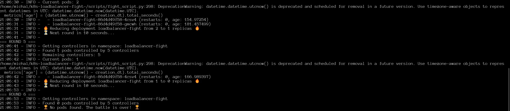

# k8s-loadbalancer-fight ⚔️

## Overview
**k8s-loadbalancer-fight** is a fun and educational Kubernetes project that simulates a battle between multiple HTTP server pods. The battle continues until only one pod remains as the winner! 🏆

## How It Works
1. **Multiple pods** are deployed in a Kubernetes cluster
2. A **Pod Elimination Script** runs rounds of elimination:
   - Each round, a pod or deployment is selected for elimination
   - For individual pod battles: pods are directly deleted
   - For deployment battles: replica counts are gradually reduced
3. Kubernetes tries to maintain pod count, but our script keeps eliminating them
4. The last pod standing is declared the winner! 🎯🔥

## Features
- Customizable elimination strategies (random, youngest, oldest, resource-hog)
- Detailed battle logs showing pod metrics
- Works with any Kubernetes setup (tested with kind)
- Battle both individual pods and their controllers (Deployments, ReplicaSets)
- Configurable battle parameters (rounds, interval)

## Getting Started
### Prerequisites
- **Docker** installed and running
- **kind (Kubernetes in Docker)** installed
- **kubectl** configured

### Deployment Steps
1. **Create a kind cluster**:
   ```sh
   task delete-cluster
   task deploy-app
   ```

2. **Check that pods are running**:
   ```sh
   kubectl get pods -n loadbalancer-fight
   ```

3. **Forward port to access the service locally** (optional):
   ```sh
   task forward-port
   ```

4. **Start the battle**:
   ```sh
   task fight
   ```

5. **Check the status during battle**:
   ```sh
   task status
   ```

6. **Reset everything and start over**:
   ```sh
   task reset
   ```

## Battle Strategies
- **random** (default): Randomly selects pods/deployments for elimination
- **youngest**: Eliminates the newest pods first
- **oldest**: Eliminates the oldest pods first
- **resource-hog**: Eliminates pods using the most resources

Example with specific strategy:
```sh
python scripts/fight_script.py --strategy resource-hog
```

## Task Automation
The project includes a Taskfile.yml with predefined tasks:
- `delete-cluster`: Removes the kind cluster
- `deploy-app`: Deploys the application to Kubernetes
- `forward-port`: Sets up port forwarding
- `fight`: Starts the pod elimination battle
- `status`: Shows current battle status
- `reset`: Resets the cluster and redeploys

## Project Structure
```
k8s-loadbalancer-fight/
├── k8s/
│   ├── configmap.yaml   # Configuration for pods
│   ├── deployment.yaml  # Pod deployment specifications
│   ├── namespace.yaml   # Kubernetes namespace definition
│   └── service.yaml     # Service exposing the pods
├── scripts/
│   └── fight_script.py  # The battle elimination script
└── Taskfile.yml         # Task definitions for automation
```

## Troubleshooting
- If pods keep regenerating: The script now targets deployments instead of individual pods
- If no pods are found: Make sure you're using the correct namespace (`loadbalancer-fight`)
- For battle customization: Use the appropriate flags with the script

## Results 



## License
This project is open-source under the MIT License.